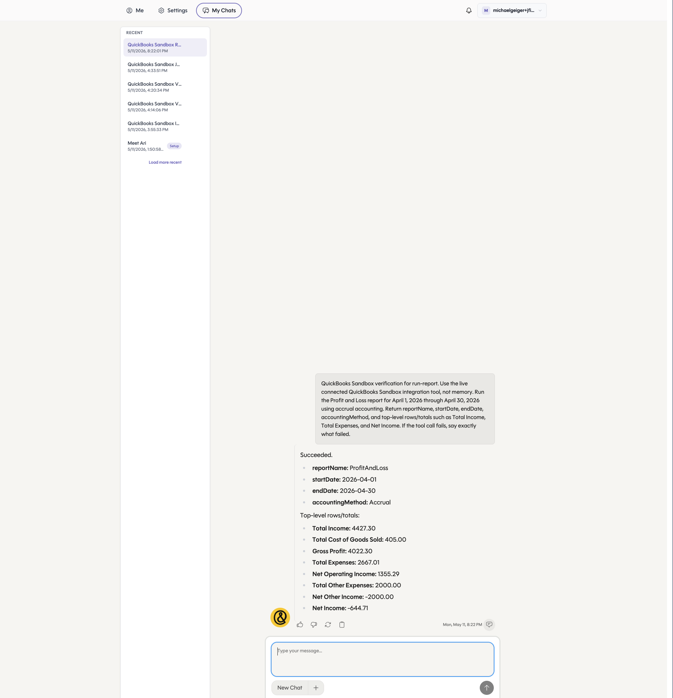

# QuickBooks PR 1/7: run-report

Branch: `codex/qb-run-report`

Use this runbook to verify the shared QuickBooks helper foundation and `run-report` action against a QuickBooks sandbox connection.

## Setup

```bash
cd /Users/michaelgeiger/.codex/worktrees/456c/link
git switch codex/qb-run-report
git pull --ff-only
cd nango.dev

set -a
source ../.env
set +a

export NANGO_ENV="${NANGO_ENV:-dev}"
export NANGO_PROVIDER_CONFIG_KEY="${NANGO_PROVIDER_CONFIG_KEY:-quickbooks}"
export NANGO_CONNECTION_ID="<quickbooks-connection-id>"
```

## Verify Connection

```bash
curl -sS --get "https://api.nango.dev/connections/${NANGO_CONNECTION_ID}" \
  --data-urlencode "provider_config_key=${NANGO_PROVIDER_CONFIG_KEY}" \
  --header "Authorization: Bearer ${NANGO_SECRET_KEY}" \
  | node -e 'let d=""; process.stdin.on("data", c => d += c); process.stdin.on("end", () => { const json = JSON.parse(d); console.log({ provider: json.provider_config_key, realmId: json.connection_config?.realmId }); });'
```

## Compile

```bash
CI=true npm run compile -- --no-interactive --no-dependency-update
```

## Dry Run

```bash
CI=true npx nango dryrun run-report "${NANGO_CONNECTION_ID}" \
  -e "${NANGO_ENV}" \
  --integration-id "${NANGO_PROVIDER_CONFIG_KEY}" \
  --validation \
  --input '{"report":"ProfitAndLoss","startDate":"2026-04-01","endDate":"2026-04-30","accountingMethod":"Accrual"}'
```

Expected result: command exits `0`, output contains `reportName`, `columns`, and `rows`.

## cURL Smoke Test

Run this only after the branch has been deployed and the action has been enabled in Nango.

```bash
curl --request POST \
  --url "https://api.nango.dev/action/trigger" \
  --header "Authorization: Bearer ${NANGO_SECRET_KEY}" \
  --header "Connection-Id: ${NANGO_CONNECTION_ID}" \
  --header "Provider-Config-Key: ${NANGO_PROVIDER_CONFIG_KEY}" \
  --header "Content-Type: application/json" \
  --data '{
    "action_name": "run-report",
    "input": {
      "report": "ProfitAndLoss",
      "startDate": "2026-04-01",
      "endDate": "2026-04-30",
      "accountingMethod": "Accrual"
    }
  }'
```

## Chrome Check

Open the connected QuickBooks sandbox, go to `Reports`, run `Profit and Loss` for April 1-30, 2026 on accrual basis, and confirm the report is available for the same company.

## Ari Chat Check

Dev chat: https://dev-eager-lederberg-f353eb.cheetah-oratrice.ts.net/chat?conversationId=b3b52b2a-9992-4253-804a-8f4d74633e40

Prompt:

```text
QuickBooks Sandbox verification for run-report. Use the live connected QuickBooks Sandbox integration tool, not memory. Run the Profit and Loss report for April 1, 2026 through April 30, 2026 using accrual accounting. Return reportName, startDate, endDate, accountingMethod, and top-level rows/totals such as Total Income, Total Expenses, and Net Income. If the tool call fails, say exactly what failed.
```

Observed result:

- `reportName`: `ProfitAndLoss`
- `startDate`: `2026-04-01`
- `endDate`: `2026-04-30`
- `accountingMethod`: `Accrual`
- `Total Income`: `4427.30`
- `Total Expenses`: `2667.01`
- `Net Income`: `-644.71`


