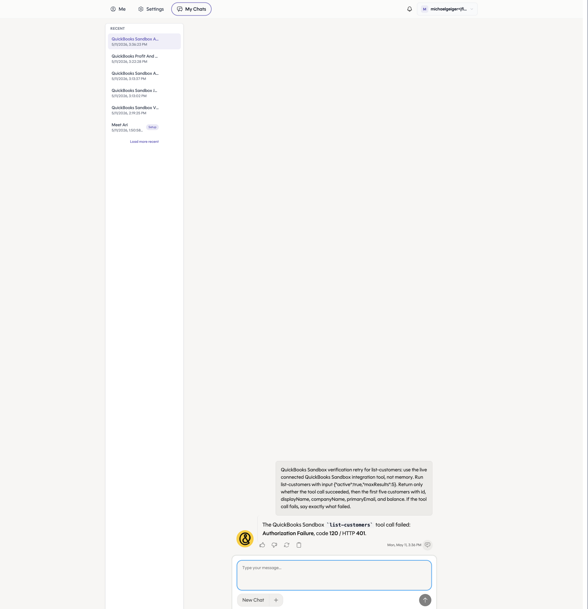

# QuickBooks PR 2/7: list-customers

Branch: `codex/qb-list-customers`

Use this runbook to verify the `list-customers` action.

## Setup

```bash
cd /Users/michaelgeiger/.codex/worktrees/456c/link
git switch codex/qb-list-customers
git pull --ff-only
cd nango.dev

set -a
source ../.env
set +a

export NANGO_ENV="${NANGO_ENV:-dev}"
export NANGO_PROVIDER_CONFIG_KEY="${NANGO_PROVIDER_CONFIG_KEY:-quickbooks}"
export NANGO_CONNECTION_ID="<quickbooks-connection-id>"
```

## Compile

```bash
CI=true npm run compile -- --no-interactive --no-dependency-update
```

## Deploy

Deploy the same action code to both provider config keys. `quickbooks-sandbox` is a thin Nango entrypoint that reuses the `quickbooks` action implementation, so this does not duplicate business logic.

```bash
CI=true npx nango deploy "${NANGO_ENV}" \
  --integration quickbooks \
  --action list-customers \
  --auto-confirm \
  --no-interactive \
  --no-dependency-update
```

```bash
CI=true npx nango deploy "${NANGO_ENV}" \
  --integration quickbooks-sandbox \
  --action list-customers \
  --auto-confirm \
  --no-interactive \
  --no-dependency-update
```

## Dry Run

```bash
CI=true npx nango dryrun list-customers "${NANGO_CONNECTION_ID}" \
  -e "${NANGO_ENV}" \
  --integration-id "${NANGO_PROVIDER_CONFIG_KEY}" \
  --validation \
  --input '{"active":true,"maxResults":5}'
```

Expected result: command exits `0`, `customers` is an array, and any missing QuickBooks fields are normalized to empty strings rather than `null`.

## cURL Smoke Test

Run this only after the branch has been deployed and the action has been enabled in Nango.

```bash
curl --request POST \
  --url "https://api.nango.dev/action/trigger" \
  --header "Authorization: Bearer ${NANGO_SECRET_KEY}" \
  --header "Connection-Id: ${NANGO_CONNECTION_ID}" \
  --header "Provider-Config-Key: ${NANGO_PROVIDER_CONFIG_KEY}" \
  --header "Content-Type: application/json" \
  --data '{
    "action_name": "list-customers",
    "input": {
      "active": true,
      "maxResults": 5
    }
  }'
```

## Chrome Check

Open the connected QuickBooks sandbox, go to `Customer Hub` or `Sales > Customers`, and confirm at least one returned customer display name appears in the UI.

## Ari Dev App Smoke Test

2026-05-11 result against the dev app chat:



The Ari chat returned `Authorization Failure`, QuickBooks code `120`, HTTP `401`.

Direct Nango verification after redeploy:

```text
connection 2fdc5288-733f-42b6-aceb-ee4b3d4230f6: HTTP 200, first customer "Amy's Bird Sanctuary"
connection db26d92f-f945-4e98-be1a-a5f165161504: HTTP 424 from Nango, upstream QuickBooks HTTP 401, code 120
```

Interpretation: the `quickbooks-sandbox` action is deployed and works for valid sandbox connections. The Ari failure matches a stale or unauthorized Nango connection, not a missing action deploy or action code failure.
