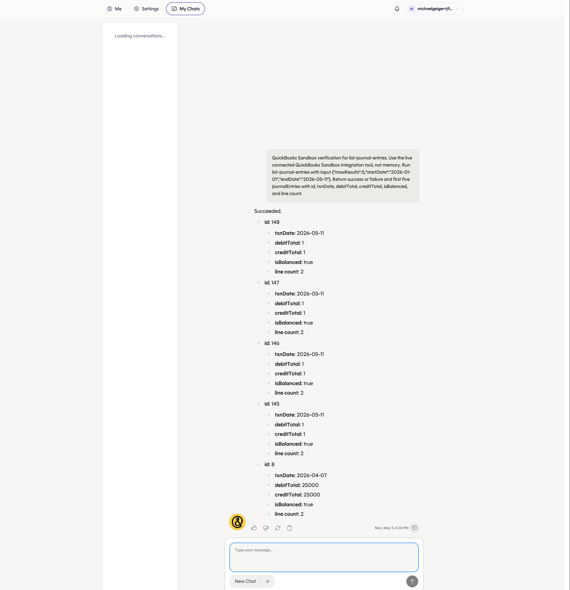

# QuickBooks PR 6/7: list-journal-entries

Branch: `codex/qb-journal-entries-flat`

Use this runbook to verify the `list-journal-entries` action.

## Setup

```bash
cd /Users/michaelgeiger/.codex/worktrees/456c/link
git switch codex/qb-journal-entries-flat
git pull --ff-only
cd nango.dev

set -a
source ../.env
set +a

export NANGO_ENV="${NANGO_ENV:-dev}"
export NANGO_PROVIDER_CONFIG_KEY="${NANGO_PROVIDER_CONFIG_KEY:-quickbooks}"
export NANGO_CONNECTION_ID="<quickbooks-connection-id>"
```

## Compile

```bash
CI=true npm run compile -- --no-interactive --no-dependency-update
```

## Deploy

Deploy the same action code to both provider config keys. `quickbooks-sandbox` is a thin Nango entrypoint that reuses the `quickbooks` action implementation, so this does not duplicate business logic.

```bash
CI=true npx nango deploy "${NANGO_ENV}" \
  --integration quickbooks \
  --action list-journal-entries \
  --auto-confirm \
  --no-interactive \
  --no-dependency-update
```

```bash
CI=true npx nango deploy "${NANGO_ENV}" \
  --integration quickbooks-sandbox \
  --action list-journal-entries \
  --auto-confirm \
  --no-interactive \
  --no-dependency-update
```

## Dry Run

```bash
CI=true npx nango dryrun list-journal-entries "${NANGO_CONNECTION_ID}" \
  -e "${NANGO_ENV}" \
  --integration-id "${NANGO_PROVIDER_CONFIG_KEY}" \
  --validation \
  --input '{"maxResults":5,"startDate":"2026-01-01","endDate":"2026-05-11"}'
```

Expected result: command exits `0`, `journalEntries` is an array, and each returned entry includes `debitTotal`, `creditTotal`, and `isBalanced`.

## cURL Smoke Test

Run this only after the branch has been deployed and the action has been enabled in Nango.

```bash
curl --request POST \
  --url "https://api.nango.dev/action/trigger" \
  --header "Authorization: Bearer ${NANGO_SECRET_KEY}" \
  --header "Connection-Id: ${NANGO_CONNECTION_ID}" \
  --header "Provider-Config-Key: ${NANGO_PROVIDER_CONFIG_KEY}" \
  --header "Content-Type: application/json" \
  --data '{
    "action_name": "list-journal-entries",
    "input": {
      "maxResults": 5,
      "startDate": "2026-01-01",
      "endDate": "2026-05-11"
    }
  }'
```

## Chrome Check

Open the connected QuickBooks sandbox, use the global search or accounting reports to find one returned journal entry, and confirm the debit and credit lines balance.

## Ari Dev App Smoke Test

2026-05-11 result against the dev app chat after deploying `list-journal-entries` to both `quickbooks` and `quickbooks-sandbox`:

[Ari chat](https://dev-eager-lederberg-f353eb.cheetah-oratrice.ts.net/chat?conversationId=df4f3fad-98f9-4d0d-b3a8-57db128e1e34)



The Ari chat returned `Succeeded` and listed five journal entries from the live QuickBooks Sandbox tool call with `debitTotal`, `creditTotal`, `isBalanced`, and line count.

Direct Nango verification after deploy:

```text
connection 29477c67-32f6-45cf-bfad-513258b9c4c0: HTTP 200, first journal entry id 148, txnDate 2026-05-11, debitTotal 1, creditTotal 1, isBalanced true, lineCount 2
```

Interpretation: the `quickbooks-sandbox` action is deployed and returns balanced journal-entry summaries for the live dev-app connection.
