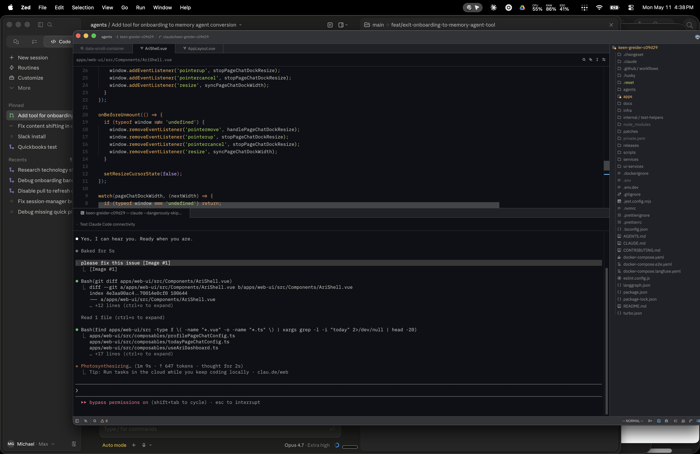

# QuickBooks PR 7/7: create-journal-entry

Branch: `codex/qb-create-journal-entry`

Use this runbook to verify the `create-journal-entry` action. This writes a small balanced journal entry to the connected QuickBooks sandbox.

## Setup

```bash
cd /Users/michaelgeiger/.codex/worktrees/456c/link
git switch codex/qb-create-journal-entry
git pull --ff-only
cd nango.dev

set -a
source ../.env
set +a

export NANGO_ENV="${NANGO_ENV:-dev}"
export NANGO_PROVIDER_CONFIG_KEY="${NANGO_PROVIDER_CONFIG_KEY:-quickbooks}"
export NANGO_CONNECTION_ID="<quickbooks-connection-id>"
```

## Get Company And Accounts

```bash
export QBO_COMPANY_ID="$(
  curl -sS --get "https://api.nango.dev/connections/${NANGO_CONNECTION_ID}" \
    --data-urlencode "provider_config_key=${NANGO_PROVIDER_CONFIG_KEY}" \
    --header "Authorization: Bearer ${NANGO_SECRET_KEY}" \
    | node -e 'let d=""; process.stdin.on("data", c => d += c); process.stdin.on("end", () => process.stdout.write(JSON.parse(d).connection_config.realmId));'
)"

curl -sS --get "https://api.nango.dev/proxy/v3/company/${QBO_COMPANY_ID}/query" \
  --data-urlencode "query=SELECT * FROM Account WHERE Active = true MAXRESULTS 20" \
  --header "Authorization: Bearer ${NANGO_SECRET_KEY}" \
  --header "Connection-Id: ${NANGO_CONNECTION_ID}" \
  --header "Provider-Config-Key: ${NANGO_PROVIDER_CONFIG_KEY}" \
  | node -e 'let d=""; process.stdin.on("data", c => d += c); process.stdin.on("end", () => { const rows = JSON.parse(d).QueryResponse?.Account ?? []; console.table(rows.map(a => ({ id: a.Id, name: a.Name, type: a.AccountType })).slice(0, 20)); });'
```

Choose two account IDs from the table and export them:

```bash
export DEBIT_ACCOUNT_ID="<expense-or-asset-account-id>"
export CREDIT_ACCOUNT_ID="<bank-liability-equity-or-income-account-id>"
```

## Compile

```bash
CI=true npm run compile -- --no-interactive --no-dependency-update
```

## Deploy

Deploy the same action code to both provider config keys. `quickbooks-sandbox` is a thin Nango entrypoint that reuses the `quickbooks` action implementation, so this does not duplicate business logic.

```bash
CI=true npx nango deploy "${NANGO_ENV}" \
  --integration quickbooks \
  --action create-journal-entry \
  --auto-confirm \
  --no-interactive \
  --no-dependency-update
```

```bash
CI=true npx nango deploy "${NANGO_ENV}" \
  --integration quickbooks-sandbox \
  --action create-journal-entry \
  --auto-confirm \
  --no-interactive \
  --no-dependency-update
```

## Dry Run

```bash
CI=true npx nango dryrun create-journal-entry "${NANGO_CONNECTION_ID}" \
  -e "${NANGO_ENV}" \
  --integration-id "${NANGO_PROVIDER_CONFIG_KEY}" \
  --validation \
  --input "{
    \"txnDate\": \"2026-05-11\",
    \"privateNote\": \"Nango sandbox create-journal-entry smoke test\",
    \"lines\": [
      { \"postingType\": \"Debit\", \"amount\": 1, \"accountId\": \"${DEBIT_ACCOUNT_ID}\", \"description\": \"Smoke test debit\" },
      { \"postingType\": \"Credit\", \"amount\": 1, \"accountId\": \"${CREDIT_ACCOUNT_ID}\", \"description\": \"Smoke test credit\" }
    ]
  }"
```

Expected result: command exits `0`, returns an `id`, `debitTotal` equals `creditTotal`, and `isBalanced` is `true`.

## cURL Smoke Test

Run this only after the branch has been deployed and the action has been enabled in Nango.

```bash
curl --request POST \
  --url "https://api.nango.dev/action/trigger" \
  --header "Authorization: Bearer ${NANGO_SECRET_KEY}" \
  --header "Connection-Id: ${NANGO_CONNECTION_ID}" \
  --header "Provider-Config-Key: ${NANGO_PROVIDER_CONFIG_KEY}" \
  --header "Content-Type: application/json" \
  --data "{
    \"action_name\": \"create-journal-entry\",
    \"input\": {
      \"txnDate\": \"2026-05-11\",
      \"privateNote\": \"Nango sandbox create-journal-entry curl smoke test\",
      \"lines\": [
        { \"postingType\": \"Debit\", \"amount\": 1, \"accountId\": \"${DEBIT_ACCOUNT_ID}\", \"description\": \"Curl smoke test debit\" },
        { \"postingType\": \"Credit\", \"amount\": 1, \"accountId\": \"${CREDIT_ACCOUNT_ID}\", \"description\": \"Curl smoke test credit\" }
      ]
    }
  }"
```

## Chrome Check

Open the connected QuickBooks sandbox, use the global search for `Nango sandbox create-journal-entry`, and confirm the created journal entry has one debit and one credit line for the same amount.

## Ari Dev App Smoke Test

2026-05-11 result against the dev app chat after deploying `create-journal-entry` to both `quickbooks` and `quickbooks-sandbox`:

[Ari chat](https://dev-eager-lederberg-f353eb.cheetah-oratrice.ts.net/chat?conversationId=50491049-270a-4b5c-bc8c-ab1ccd2cd25c)



The Ari chat returned `Success` and created journal entry id `150`, doc number `ARI-CHAT-0511C`, with `debitTotal: 1`, `creditTotal: 1`, and `isBalanced: true`.

Direct Nango verification after deploy:

```text
connection 29477c67-32f6-45cf-bfad-513258b9c4c0: HTTP 200, created journal entry id 149, docNumber ARI-0511202415, debitTotal 1, creditTotal 1, isBalanced true
```

Interpretation: the `quickbooks-sandbox` action is deployed and can create a balanced journal entry through both direct Nango and the dev-app Ari chat.
