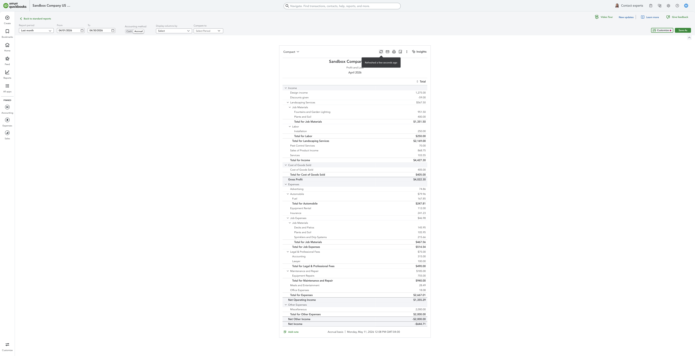
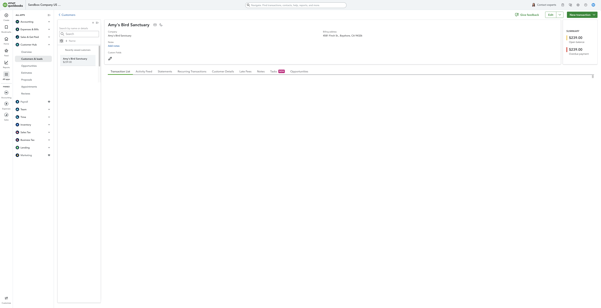
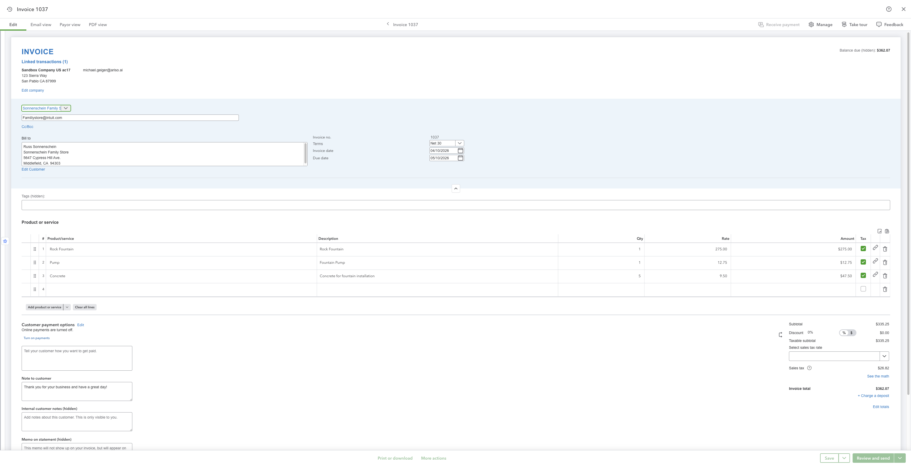
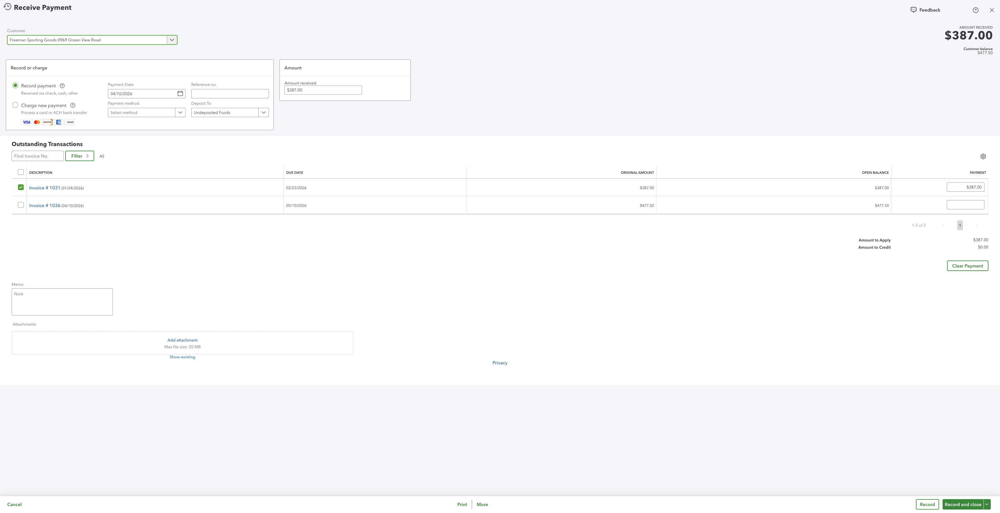
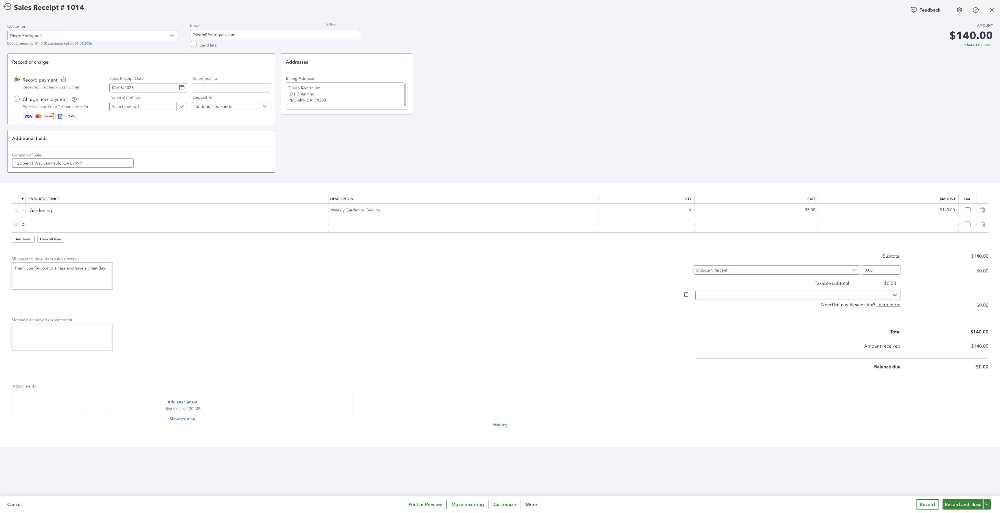
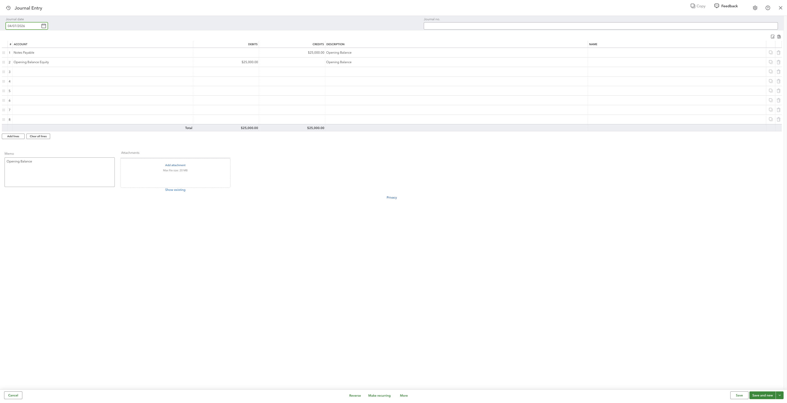

# QuickBooks Live Verification Report

Date: 2026-05-11

This report verifies the seven QuickBooks actions against the authenticated QuickBooks sandbox UI and live Nango action trigger responses. The Nango calls used `POST https://api.nango.dev/action/trigger` with `Provider-Config-Key: quickbooks-sandbox`, `Connection-Id: 2fdc5288-733f-42b6-aceb-ee4b3d4230f6`, and the local dev Nango secret. These are live deployed Nango action calls, not `nango dryrun` calls.

## Summary

| # | Action | QuickBooks UI | Screenshot | Nango payload | Match checked |
| - | - | - | - | - | - |
| 1 | `run-report` | [QuickBooks](https://sandbox.qbo.intuit.com/app/report/builder?rptId=sbg%3Ac46c823a-8641-4641-b08a-dda0e499066f&type=system&token=PANDL&previousRoute=standardreports&previousRouteText=Back+to+standard+reports&payloadId=cf967b08-35e6-414b-ab5b-01bd3ea44c9b) | [screenshot](./01-run-report.png) | [JSON](./01-run-report.payload.json) | Profit and Loss, Last month / April 2026, accrual basis, Net Income -644.71. |
| 2 | `list-customers` | [QuickBooks](https://sandbox.qbo.intuit.com/app/customerdetail?nameId=1) | [screenshot](./02-list-customers.png) | [JSON](./02-list-customers.payload.json) | Customer id 1, Amy's Bird Sanctuary, balance 239.00, email Birds@Intuit.com. |
| 3 | `list-invoices` | [QuickBooks](https://sandbox.qbo.intuit.com/app/invoice?txnId=130) | [screenshot](./03-list-invoices.png) | [JSON](./03-list-invoices.payload.json) | Invoice id 130 / doc 1037, Sonnenschein Family Store, txnDate 2026-04-10, total and balance 362.07. |
| 4 | `list-payments` | [QuickBooks](https://sandbox.qbo.intuit.com/app/recvpayment?txnId=128) | [screenshot](./04-list-payments.png) | [JSON](./04-list-payments.payload.json) | Payment id 128, customer 0969 Ocean View Road, txnDate 2026-04-10, amount 387.00. |
| 5 | `list-sales-receipts` | [QuickBooks](https://sandbox.qbo.intuit.com/app/salesreceipt?txnId=47) | [screenshot](./05-list-sales-receipts.png) | [JSON](./05-list-sales-receipts.payload.json) | Sales receipt id 47 / doc 1014, Diego Rodriguez, txnDate 2026-04-06, total 140.00. |
| 6 | `list-journal-entries` | [QuickBooks](https://sandbox.qbo.intuit.com/app/journal?txnId=8) | [screenshot](./06-list-journal-entries.png) | [JSON](./06-list-journal-entries.payload.json) | Journal entry id 8, Opening Balance memo, Notes Payable and Opening Balance Equity, debit and credit totals 25000.00. |
| 7 | `create-journal-entry` | [QuickBooks](https://sandbox.qbo.intuit.com/app/journal?txnId=147) | [screenshot](./07-create-journal-entry.png) | [JSON](./07-create-journal-entry.payload.json) | Created journal entry id 147 / doc NANGO-0511160142, 2026-05-11, debit 1.00 to Legal & Professional Fees:Accounting and credit 1.00 to Checking. |

## Notes and Ambiguity

- The QuickBooks links require an authenticated sandbox browser session for the same Intuit account.
- The Profit and Loss UI displays the selected range as "April 2026" after choosing "Last month". The payload has explicit `startPeriod: 2026-04-01` and `endPeriod: 2026-04-30`.
- The payment UI displays the customer with its parent path as "Freeman Sporting Goods:0969 Ocean View Road". The Nango payload normalizes the customer reference to `{ id: "8", name: "0969 Ocean View Road" }`.
- QuickBooks returns journal debit and credit totals clearly and the action output returns `isBalanced: true`; the UI total row also shows equal debit and credit totals.
- The create journal entry check writes a real sandbox transaction. The evidence record created here is journal id `147`, document number `NANGO-0511160142`.

## Live Trigger Shape

Use this command shape for each action. The payload files below are the responses saved from these live triggers.

```bash
curl --request POST \
  --url https://api.nango.dev/action/trigger \
  --header "Authorization: Bearer $NANGO_SECRET_KEY" \
  --header "Connection-Id: $NANGO_CONNECTION_ID" \
  --header "Provider-Config-Key: quickbooks-sandbox" \
  --header "Content-Type: application/json" \
  --data '{
    "action_name": "<action-name>",
    "input": { }
  }'
```

## 1. run-report

QuickBooks URL: [https://sandbox.qbo.intuit.com/app/report/builder?rptId=sbg%3Ac46c823a-8641-4641-b08a-dda0e499066f&type=system&token=PANDL&previousRoute=standardreports&previousRouteText=Back+to+standard+reports&payloadId=cf967b08-35e6-414b-ab5b-01bd3ea44c9b](https://sandbox.qbo.intuit.com/app/report/builder?rptId=sbg%3Ac46c823a-8641-4641-b08a-dda0e499066f&type=system&token=PANDL&previousRoute=standardreports&previousRouteText=Back+to+standard+reports&payloadId=cf967b08-35e6-414b-ab5b-01bd3ea44c9b)

Screenshot: [01-run-report.png](./01-run-report.png)



Observed match: Profit and Loss, Last month / April 2026, accrual basis, Net Income -644.71.

Saved payload file: [01-run-report.payload.json](./01-run-report.payload.json)

<details>
<summary>Nango JSON payload</summary>

```json
{
  "reportName": "ProfitAndLoss",
  "startPeriod": "2026-04-01",
  "endPeriod": "2026-04-30",
  "currency": "USD",
  "columns": [
    {
      "ColTitle": "",
      "ColType": "Account",
      "MetaData": [
        {
          "Name": "ColKey",
          "Value": "account"
        }
      ]
    },
    {
      "ColTitle": "Total",
      "ColType": "Money",
      "MetaData": [
        {
          "Name": "ColKey",
          "Value": "total"
        }
      ]
    }
  ],
  "rows": [
    {
      "Header": {
        "ColData": [
          {
            "value": "Income"
          },
          {
            "value": ""
          }
        ]
      },
      "Rows": {
        "Row": [
          {
            "ColData": [
              {
                "value": "Design income",
                "id": "82"
              },
              {
                "value": "1275.00"
              }
            ],
            "type": "Data"
          },
          {
            "ColData": [
              {
                "value": "Discounts given",
                "id": "86"
              },
              {
                "value": "-59.00"
              }
            ],
            "type": "Data"
          },
          {
            "Header": {
              "ColData": [
                {
                  "value": "Landscaping Services",
                  "id": "45"
                },
                {
                  "value": "567.50"
                }
              ]
            },
            "Rows": {
              "Row": [
                {
                  "Header": {
                    "ColData": [
                      {
                        "value": "Job Materials",
                        "id": "46"
                      },
                      {
                        "value": ""
                      }
                    ]
                  },
                  "Rows": {
                    "Row": [
                      {
                        "ColData": [
                          {
                            "value": "Fountains and Garden Lighting",
                            "id": "48"
                          },
                          {
                            "value": "951.50"
                          }
                        ],
                        "type": "Data"
                      },
                      {
                        "ColData": [
                          {
                            "value": "Plants and Soil",
                            "id": "49"
                          },
                          {
                            "value": "400.00"
                          }
                        ],
                        "type": "Data"
                      }
                    ]
                  },
                  "Summary": {
                    "ColData": [
                      {
                        "value": "Total Job Materials"
                      },
                      {
                        "value": "1351.50"
                      }
                    ]
                  },
                  "type": "Section"
                },
                {
                  "Header": {
                    "ColData": [
                      {
                        "value": "Labor",
                        "id": "51"
                      },
                      {
                        "value": ""
                      }
                    ]
                  },
                  "Rows": {
                    "Row": [
                      {
                        "ColData": [
                          {
                            "value": "Installation",
                            "id": "52"
                          },
                          {
                            "value": "250.00"
                          }
                        ],
                        "type": "Data"
                      }
                    ]
                  },
                  "Summary": {
                    "ColData": [
                      {
                        "value": "Total Labor"
                      },
                      {
                        "value": "250.00"
                      }
                    ]
                  },
                  "type": "Section"
                }
              ]
            },
            "Summary": {
              "ColData": [
                {
                  "value": "Total Landscaping Services"
                },
                {
                  "value": "2169.00"
                }
              ]
            },
            "type": "Section"
          },
          {
            "ColData": [
              {
                "value": "Pest Control Services",
                "id": "54"
              },
              {
                "value": "70.00"
              }
            ],
            "type": "Data"
          },
          {
            "ColData": [
              {
                "value": "Sales of Product Income",
                "id": "79"
              },
              {
                "value": "868.75"
              }
            ],
            "type": "Data"
          },
          {
            "ColData": [
              {
                "value": "Services",
                "id": "1"
              },
              {
                "value": "103.55"
              }
            ],
            "type": "Data"
          }
        ]
      },
      "Summary": {
        "ColData": [
          {
            "value": "Total Income"
          },
          {
            "value": "4427.30"
          }
        ]
      },
      "type": "Section",
      "group": "Income"
    },
    {
      "Header": {
        "ColData": [
          {
            "value": "Cost of Goods Sold"
          },
          {
            "value": ""
          }
        ]
      },
      "Rows": {
        "Row": [
          {
            "ColData": [
              {
                "value": "Cost of Goods Sold",
                "id": "80"
              },
              {
                "value": "405.00"
              }
            ],
            "type": "Data"
          }
        ]
      },
      "Summary": {
        "ColData": [
          {
            "value": "Total Cost of Goods Sold"
          },
          {
            "value": "405.00"
          }
        ]
      },
      "type": "Section",
      "group": "COGS"
    },
    {
      "Summary": {
        "ColData": [
          {
            "value": "Gross Profit"
          },
          {
            "value": "4022.30"
          }
        ]
      },
      "type": "Section",
      "group": "GrossProfit"
    },
    {
      "Header": {
        "ColData": [
          {
            "value": "Expenses"
          },
          {
            "value": ""
          }
        ]
      },
      "Rows": {
        "Row": [
          {
            "ColData": [
              {
                "value": "Advertising",
                "id": "7"
              },
              {
                "value": "74.86"
              }
            ],
            "type": "Data"
          },
          {
            "Header": {
              "ColData": [
                {
                  "value": "Automobile",
                  "id": "55"
                },
                {
                  "value": "79.96"
                }
              ]
            },
            "Rows": {
              "Row": [
                {
                  "ColData": [
                    {
                      "value": "Fuel",
                      "id": "56"
                    },
                    {
                      "value": "167.85"
                    }
                  ],
                  "type": "Data"
                }
              ]
            },
            "Summary": {
              "ColData": [
                {
                  "value": "Total Automobile"
                },
                {
                  "value": "247.81"
                }
              ]
            },
            "type": "Section"
          },
          {
            "ColData": [
              {
                "value": "Equipment Rental",
                "id": "29"
              },
              {
                "value": "112.00"
              }
            ],
            "type": "Data"
          },
          {
            "ColData": [
              {
                "value": "Insurance",
                "id": "11"
              },
              {
                "value": "241.23"
              }
            ],
            "type": "Data"
          },
          {
            "Header": {
              "ColData": [
                {
                  "value": "Job Expenses",
                  "id": "58"
                },
                {
                  "value": "46.98"
                }
              ]
            },
            "Rows": {
              "Row": [
                {
                  "Header": {
                    "ColData": [
                      {
                        "value": "Job Materials",
                        "id": "63"
                      },
                      {
                        "value": ""
                      }
                    ]
                  },
                  "Rows": {
                    "Row": [
                      {
                        "ColData": [
                          {
                            "value": "Decks and Patios",
                            "id": "64"
                          },
                          {
                            "value": "145.95"
                          }
                        ],
                        "type": "Data"
                      },
                      {
                        "ColData": [
                          {
                            "value": "Plants and Soil",
                            "id": "66"
                          },
                          {
                            "value": "105.95"
                          }
                        ],
                        "type": "Data"
                      },
                      {
                        "ColData": [
                          {
                            "value": "Sprinklers and Drip Systems",
                            "id": "67"
                          },
                          {
                            "value": "215.66"
                          }
                        ],
                        "type": "Data"
                      }
                    ]
                  },
                  "Summary": {
                    "ColData": [
                      {
                        "value": "Total Job Materials"
                      },
                      {
                        "value": "467.56"
                      }
                    ]
                  },
                  "type": "Section"
                }
              ]
            },
            "Summary": {
              "ColData": [
                {
                  "value": "Total Job Expenses"
                },
                {
                  "value": "514.54"
                }
              ]
            },
            "type": "Section"
          },
          {
            "Header": {
              "ColData": [
                {
                  "value": "Legal & Professional Fees",
                  "id": "12"
                },
                {
                  "value": "75.00"
                }
              ]
            },
            "Rows": {
              "Row": [
                {
                  "ColData": [
                    {
                      "value": "Accounting",
                      "id": "69"
                    },
                    {
                      "value": "315.00"
                    }
                  ],
                  "type": "Data"
                },
                {
                  "ColData": [
                    {
                      "value": "Lawyer",
                      "id": "71"
                    },
                    {
                      "value": "100.00"
                    }
                  ],
                  "type": "Data"
                }
              ]
            },
            "Summary": {
              "ColData": [
                {
                  "value": "Total Legal & Professional Fees"
                },
                {
                  "value": "490.00"
                }
              ]
            },
            "type": "Section"
          },
          {
            "Header": {
              "ColData": [
                {
                  "value": "Maintenance and Repair",
                  "id": "72"
                },
                {
                  "value": "185.00"
                }
              ]
            },
            "Rows": {
              "Row": [
                {
                  "ColData": [
                    {
                      "value": "Equipment Repairs",
                      "id": "75"
                    },
                    {
                      "value": "755.00"
                    }
                  ],
                  "type": "Data"
                }
              ]
            },
            "Summary": {
              "ColData": [
                {
                  "value": "Total Maintenance and Repair"
                },
                {
                  "value": "940.00"
                }
              ]
            },
            "type": "Section"
          },
          {
            "ColData": [
              {
                "value": "Meals and Entertainment",
                "id": "13"
              },
              {
                "value": "28.49"
              }
            ],
            "type": "Data"
          },
          {
            "ColData": [
              {
                "value": "Office Expenses",
                "id": "15"
              },
              {
                "value": "18.08"
              }
            ],
            "type": "Data"
          }
        ]
      },
      "Summary": {
        "ColData": [
          {
            "value": "Total Expenses"
          },
          {
            "value": "2667.01"
          }
        ]
      },
      "type": "Section",
      "group": "Expenses"
    },
    {
      "Summary": {
        "ColData": [
          {
            "value": "Net Operating Income"
          },
          {
            "value": "1355.29"
          }
        ]
      },
      "type": "Section",
      "group": "NetOperatingIncome"
    },
    {
      "Header": {
        "ColData": [
          {
            "value": "Other Expenses"
          },
          {
            "value": ""
          }
        ]
      },
      "Rows": {
        "Row": [
          {
            "ColData": [
              {
                "value": "Miscellaneous",
                "id": "14"
              },
              {
                "value": "2000.00"
              }
            ],
            "type": "Data"
          }
        ]
      },
      "Summary": {
        "ColData": [
          {
            "value": "Total Other Expenses"
          },
          {
            "value": "2000.00"
          }
        ]
      },
      "type": "Section",
      "group": "OtherExpenses"
    },
    {
      "Summary": {
        "ColData": [
          {
            "value": "Net Other Income"
          },
          {
            "value": "-2000.00"
          }
        ]
      },
      "type": "Section",
      "group": "NetOtherIncome"
    },
    {
      "Summary": {
        "ColData": [
          {
            "value": "Net Income"
          },
          {
            "value": "-644.71"
          }
        ]
      },
      "type": "Section",
      "group": "NetIncome"
    }
  ]
}
```

</details>

## 2. list-customers

QuickBooks URL: [https://sandbox.qbo.intuit.com/app/customerdetail?nameId=1](https://sandbox.qbo.intuit.com/app/customerdetail?nameId=1)

Screenshot: [02-list-customers.png](./02-list-customers.png)



Observed match: Customer id 1, Amy's Bird Sanctuary, balance 239.00, email Birds@Intuit.com.

Saved payload file: [02-list-customers.payload.json](./02-list-customers.payload.json)

<details>
<summary>Nango JSON payload</summary>

```json
{
  "customers": [
    {
      "id": "1",
      "displayName": "Amy's Bird Sanctuary",
      "active": true,
      "companyName": "Amy's Bird Sanctuary",
      "givenName": "Amy",
      "familyName": "Lauterbach",
      "primaryEmail": "Birds@Intuit.com",
      "primaryPhone": "(650) 555-3311",
      "balance": 239,
      "currency": {
        "id": "USD",
        "name": "United States Dollar"
      },
      "metadata": {
        "createTime": "2026-04-02T16:48:43-07:00",
        "lastUpdatedTime": "2026-04-09T13:39:32-07:00"
      }
    }
  ],
  "startPosition": 1,
  "maxResults": 1,
  "totalCount": 1
}
```

</details>

## 3. list-invoices

QuickBooks URL: [https://sandbox.qbo.intuit.com/app/invoice?txnId=130](https://sandbox.qbo.intuit.com/app/invoice?txnId=130)

Screenshot: [03-list-invoices.png](./03-list-invoices.png)



Observed match: Invoice id 130 / doc 1037, Sonnenschein Family Store, txnDate 2026-04-10, total and balance 362.07.

Saved payload file: [03-list-invoices.payload.json](./03-list-invoices.payload.json)

<details>
<summary>Nango JSON payload</summary>

```json
{
  "invoices": [
    {
      "id": "130",
      "docNumber": "1037",
      "txnDate": "2026-04-10",
      "dueDate": "2026-05-10",
      "customer": {
        "id": "24",
        "name": "Sonnenschein Family Store"
      },
      "totalAmount": 362.07,
      "balance": 362.07,
      "currency": {
        "id": "USD",
        "name": "United States Dollar"
      },
      "emailStatus": "NotSet",
      "metadata": {
        "createTime": "2026-04-10T13:16:17-07:00",
        "lastUpdatedTime": "2026-04-10T13:16:17-07:00"
      }
    }
  ],
  "startPosition": 1,
  "maxResults": 1,
  "totalCount": 1
}
```

</details>

## 4. list-payments

QuickBooks URL: [https://sandbox.qbo.intuit.com/app/recvpayment?txnId=128](https://sandbox.qbo.intuit.com/app/recvpayment?txnId=128)

Screenshot: [04-list-payments.png](./04-list-payments.png)



Observed match: Payment id 128, customer 0969 Ocean View Road, txnDate 2026-04-10, amount 387.00.

Saved payload file: [04-list-payments.payload.json](./04-list-payments.payload.json)

<details>
<summary>Nango JSON payload</summary>

```json
{
  "payments": [
    {
      "id": "128",
      "txnDate": "2026-04-10",
      "customer": {
        "id": "8",
        "name": "0969 Ocean View Road"
      },
      "totalAmount": 387,
      "unappliedAmount": 0,
      "depositToAccount": {
        "id": "4",
        "name": ""
      },
      "paymentMethod": {
        "id": "",
        "name": ""
      },
      "metadata": {
        "createTime": "2026-04-10T13:13:33-07:00",
        "lastUpdatedTime": "2026-04-10T13:13:33-07:00"
      }
    }
  ],
  "startPosition": 1,
  "maxResults": 1,
  "totalCount": 1
}
```

</details>

## 5. list-sales-receipts

QuickBooks URL: [https://sandbox.qbo.intuit.com/app/salesreceipt?txnId=47](https://sandbox.qbo.intuit.com/app/salesreceipt?txnId=47)

Screenshot: [05-list-sales-receipts.png](./05-list-sales-receipts.png)



Observed match: Sales receipt id 47 / doc 1014, Diego Rodriguez, txnDate 2026-04-06, total 140.00.

Saved payload file: [05-list-sales-receipts.payload.json](./05-list-sales-receipts.payload.json)

<details>
<summary>Nango JSON payload</summary>

```json
{
  "salesReceipts": [
    {
      "id": "47",
      "docNumber": "1014",
      "txnDate": "2026-04-06",
      "customer": {
        "id": "4",
        "name": "Diego Rodriguez"
      },
      "totalAmount": 140,
      "balance": 0,
      "depositToAccount": {
        "id": "4",
        "name": "Undeposited Funds"
      },
      "paymentMethod": {
        "id": "",
        "name": ""
      },
      "metadata": {
        "createTime": "2026-04-08T11:40:52-07:00",
        "lastUpdatedTime": "2026-04-08T11:40:52-07:00"
      }
    }
  ],
  "startPosition": 1,
  "maxResults": 1,
  "totalCount": 1
}
```

</details>

## 6. list-journal-entries

QuickBooks URL: [https://sandbox.qbo.intuit.com/app/journal?txnId=8](https://sandbox.qbo.intuit.com/app/journal?txnId=8)

Screenshot: [06-list-journal-entries.png](./06-list-journal-entries.png)



Observed match: Journal entry id 8, Opening Balance memo, Notes Payable and Opening Balance Equity, debit and credit totals 25000.00.

Saved payload file: [06-list-journal-entries.payload.json](./06-list-journal-entries.payload.json)

<details>
<summary>Nango JSON payload</summary>

```json
{
  "journalEntries": [
    {
      "id": "8",
      "txnDate": "2026-04-07",
      "privateNote": "Opening Balance",
      "currency": {
        "id": "USD",
        "name": "United States Dollar"
      },
      "exchangeRate": 1,
      "debitTotal": 25000,
      "creditTotal": 25000,
      "isBalanced": true,
      "lines": [
        {
          "id": "0",
          "description": "Opening Balance",
          "amount": 25000,
          "postingType": "Credit",
          "account": {
            "id": "44",
            "name": "Notes Payable"
          },
          "entity": {
            "id": "",
            "name": ""
          }
        },
        {
          "id": "1",
          "description": "Opening Balance",
          "amount": 25000,
          "postingType": "Debit",
          "account": {
            "id": "34",
            "name": "Opening Balance Equity"
          },
          "entity": {
            "id": "",
            "name": ""
          }
        }
      ],
      "metadata": {
        "createTime": "2026-04-07T10:04:24-07:00",
        "lastUpdatedTime": "2026-04-07T10:04:24-07:00"
      }
    },
    {
      "id": "7",
      "txnDate": "2026-04-07",
      "privateNote": "Opening Balance",
      "currency": {
        "id": "USD",
        "name": "United States Dollar"
      },
      "exchangeRate": 1,
      "debitTotal": 4000,
      "creditTotal": 4000,
      "isBalanced": true,
      "lines": [
        {
          "id": "0",
          "description": "Opening Balance",
          "amount": 4000,
          "postingType": "Credit",
          "account": {
            "id": "43",
            "name": "Loan Payable"
          },
          "entity": {
            "id": "",
            "name": ""
          }
        },
        {
          "id": "1",
          "description": "Opening Balance",
          "amount": 4000,
          "postingType": "Debit",
          "account": {
            "id": "34",
            "name": "Opening Balance Equity"
          },
          "entity": {
            "id": "",
            "name": ""
          }
        }
      ],
      "metadata": {
        "createTime": "2026-04-07T10:03:25-07:00",
        "lastUpdatedTime": "2026-04-07T10:03:25-07:00"
      }
    }
  ],
  "startPosition": 1,
  "maxResults": 2,
  "totalCount": 2
}
```

</details>

## 7. create-journal-entry

QuickBooks URL: [https://sandbox.qbo.intuit.com/app/journal?txnId=147](https://sandbox.qbo.intuit.com/app/journal?txnId=147)

Screenshot: [07-create-journal-entry.png](./07-create-journal-entry.png)


Observed match: Created journal entry id 147 / doc NANGO-0511160142, 2026-05-11, debit 1.00 to Legal & Professional Fees:Accounting and credit 1.00 to Checking.

Saved payload file: [07-create-journal-entry.payload.json](./07-create-journal-entry.payload.json)

<details>
<summary>Nango JSON payload</summary>

```json
{
  "id": "147",
  "syncToken": "0",
  "txnDate": "2026-05-11",
  "privateNote": "Nango live action-trigger create-journal-entry 0511160142",
  "docNumber": "NANGO-0511160142",
  "currency": {
    "id": "USD",
    "name": "United States Dollar"
  },
  "exchangeRate": 1,
  "debitTotal": 1,
  "creditTotal": 1,
  "isBalanced": true,
  "lines": [
    {
      "id": "0",
      "description": "Live trigger debit",
      "amount": 1,
      "postingType": "Debit",
      "account": {
        "id": "69",
        "name": "Legal & Professional Fees:Accounting"
      },
      "entity": {
        "id": "",
        "name": ""
      },
      "classRef": {
        "id": "",
        "name": ""
      },
      "departmentRef": {
        "id": "",
        "name": ""
      }
    },
    {
      "id": "1",
      "description": "Live trigger credit",
      "amount": 1,
      "postingType": "Credit",
      "account": {
        "id": "35",
        "name": "Checking"
      },
      "entity": {
        "id": "",
        "name": ""
      },
      "classRef": {
        "id": "",
        "name": ""
      },
      "departmentRef": {
        "id": "",
        "name": ""
      }
    }
  ],
  "metadata": {
    "createTime": "2026-05-11T09:01:45-07:00",
    "lastUpdatedTime": "2026-05-11T09:01:45-07:00"
  }
}
```

</details>
